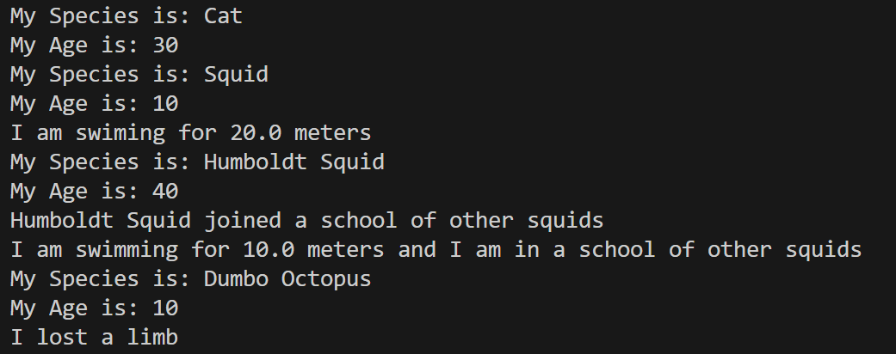

# CSC263 Inheritance

## Assignment
This assignment will help you refresh your knowledge of Java and/or learn Java’s syntax. (Reading – Ch 9, Lecture 1, Lecture 2). In addition, it will help you practice using some concepts in Object-Oriented Programming. 

## Screenshots

